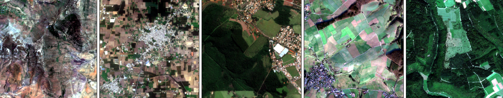
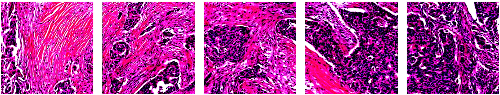

# BirdsEyeViewNet: Biomimetic transfer learning for pan-cancer computational histopathology.
#### Oz Kilim, János Báskay, András Biricz, Zsolt Bedőházi, Péter Pollner and István Csabai
##### Eötvös Loránd University. Department of Physics of Complex Systems

  
  

##### This repository contains the codebase to reproduce the results from the manuscript "BirdsEyeViewNet: Biomimetic transfer learning for pan-cancer computational histopathology" 


## Using BirdsEyeViewNet:

#### 1. Download pre-trained BirdsEyeViewNets :earth_americas: :bird: :microscope: :

https://figshare.com/articles/software/BEVNet1X_and_BEVNet2X/23694678

### 2. Script to load the BirdsEyeViewNet for applications in PyTorch:

##### Input is a 3 X 256 X 256 image and output is a 1000 long embedding. Feel free to re-use the loading code as part of your pipelines!

```analysis/load_model_playground.ipynb```


## Quick setup for paper experiments :bird: 

#### MIL Conda environment :snake: : 

```
conda env create --name clam --file=clam.yml
```

```
conda activate clam
```

## Satellite data Download :satellite: :earth_americas:

##### Add these requirements to the conda env with pip:

```
pip install satelite_download/requirements.txt
```

##### This script will save h5 files with 1000 images each.  

```satellite_download/download_ssl4eo.py``` 

##### Further details:  

1.  Install and authenticate Google Earth Engine: https://earthengine.google.com

2. Match and download pre-sampled locations
```
python download_ssl4eo.py  --save-path ./data  --dates 2021-12-21  --radius 1320  --dtype uint16 --num-workers 16 --match-file ./data/sampled_locations.csv  --indices-range 0 100000  --output h5  --batch-size 1000
```

3. Resume from interruption

```
python download_ssl4eo.py --save-path ./data --dates 2021-12-21 --radius 1320 --dtype uint16 --num-workers 16  --match-file ./data/sampled_locations.csv --indices-range 0 100000 --output h5  --batch-size 1000  --resume ./data/checked_locations.csv
```

## Self-supervised pre-training

##### Please refer to https://github.com/facebookresearch/dino for full in depth instructions on how to get DINO set up.

#### Preparing data for DINO SSL.

##### The satellite download scripts save the data as h5 files with 1000 images in each file. We convert these into tar files with 10000 images per file. This is so we can use all the GPUs available with the WebDataset package. To make the conversion please change the reading and desitination filepaths and then run. 

```python self_supervised_pre_training/transform_save_tar.py```

#### Dino script using WebDataset package 🦕

```python self_supervised_pre_training/transform_save_tar.py```


## WSI Data Download:

##### You can use the notebook (full description can be found at https://github.com/kirbyju/TCIA_Notebooks): 

```Data_download_notebooks/TCIA_Aspera_CLI_Downloads.ipynb```

#####  You could use the  IBM Aspera connector desktop app instead.

- Yale (27G):  https://wiki.cancerimagingarchive.net/pages/viewpage.action?pageId=119702524#11970252477e21ec2cbc3429c916f1eee7117d277

- Ovarian (124G): https://wiki.cancerimagingarchive.net/pages/viewpage.action?pageId=83593077  (this was transformed from tif to svs)

- BRACS (1.1T) : https://www.bracs.icar.cnr.it

- HunCRC (432G): https://wiki.cancerimagingarchive.net/pages/viewpage.action?pageId=91357370

- Diffuse Large B-Cell Lymphoma (DLBCL) (353G): https://wiki.cancerimagingarchive.net/pages/viewpage.action?pageId=119702520#119702520d02dfcba4e0f4800b2e4af3a9fd94de4

- PANDA (348G): https://www.kaggle.com/c/prostate-cancer-grade-assessment


We downloaded all datasets to the path "/tank/WSI_data"

##### Keep in mind that this is a lot of data and may take days to download you must also make sure that you have enough disk space!

## WSI data preparation.

##### The folder data_cleaning/dataset_cleaners contains a notebook for each dataset. In each notebook the downloaded metadata in data_cleaning/original_metadata is cleaned, pre-processes saved to the data_cleaning/dataset_csv folder as csv files. Our datasets and splits are provided so you do not need to re-run these notebooks but they are there to show how the clinical data was split into supervised classification tasks. See https://github.com/mahmoodlab/CLAM for further details as we have worked from this checkpoint. If you wish to use your own datasets here, csv files must be in the format: data_cleaning/dataset_csv/tumor_vs_normal_dummy_clean.csv

### Patching :hocho:  :

```
python create_patches_fp.py --source path/to/whole/slides --save_dir PATCHES/your/patch/folder --patch_size 256 --seg --patch --stitch  --patch_level 1 --preset bwh_biopsy.csv
``` 

##### You may pick a patch level. 0 represents max resolution and higher values create bags with less instances in them. We used a mixture to illustrate the robustness of our pre-trained models. 

#### We provide a script to create all patches at 10X and 20X magnification:

```./patching.sh``` 

### Splitting :scissors: .
```
python create_splits_seq.py --task task_1_tumor_vs_normal --seed 50 --label_frac 1 --k 10 --data_csv 'your/dataset/labels.csv' --split_name your/split/name --val_frac 0.1 --test_frac 0.1
``` 

#### We provide a script to create all of our splits (Make sure you have a folder named "splits" where the splits can be saved):

```./make_splits.sh``` 

## Using pre-trained networks for MIL WSI tasks. 

### Embed WSIs and create the .h5 bags of patches (instances) :hourglass_flowing_sand:
```
CUDA_VISIBLE_DEVICES=0 python extract_features_fp.py --data_h5_dir your/patch/folder --data_slide_dir path/to/whole/slides --csv_path your/dataset/labels.csv --feat_dir your/features/folder --batch_size 1024 --slide_ext .ndpi --embedder $model
```
##### This embedding phase is the rate-limiting step for the whole pipeline. To reproduce our results first embed the data patches with make sure to change the model reading paths and the .h5 saving paths (we saved our BirdsEyeViewNet models in ./CNNs/ . You must also change data_slide_dir to where you saved that particular dataset :heavy_exclamation_mark:): 

```./embed_all.sh```

### Run MIL on the embeddings and get results metrics in your/results/directory.
``` 
CUDA_VISIBLE_DEVICES=1,2 python main.py --lr 1e-4 --k 10 --exp_code task_1_tumor_vs_normal_CLAM_50 --bag_loss ce --inst_loss svm --task task_1_tumor_vs_normal --model_type mil --log_data --data_root_dir . --embedding_size 1000 --data_dir your/features/folder --exp_code code-name-for-your-experiment --split_dir your/split/name_100 --data_csv your/dataset/labels.csv --max_epochs 100  --early_stopping   --results_dir your/reasults/directory
```

#### To run all of the downstream experiments at once run this script with the generated .h5 file paths changed to your/features/folder  :running:

```./MIL_all.sh```

#### To view model training cd into your/results/directory folder and run:

```
tensorboard --logdir ./ --host=127.0.0.1
```

## Data visualization :eyes:

#### Scripts used to generate the main results figure. To visualize your own results change the reading paths to your/reasults/directory

```analysis/CLAM_CNN_pathologist_labels.ipynb``` 
```analysis/CLAM_CNN_knowledge.ipynb``` 

#### UMAP of embeddings.

```analysis/embeddings_UMAPS.ipynb``` 

### Generating pathces of 10X and 20X :microscope: run:
```./visualize_patches.sh``` 

### Visializing pathces of 10X and 20X :

```analysis/view_data.ipynb```

### Visualize kernels: 

```analysis/hungarian_matching.ipynb```

## Issues: 

#### Please write in GitHub issues section for this repository.
